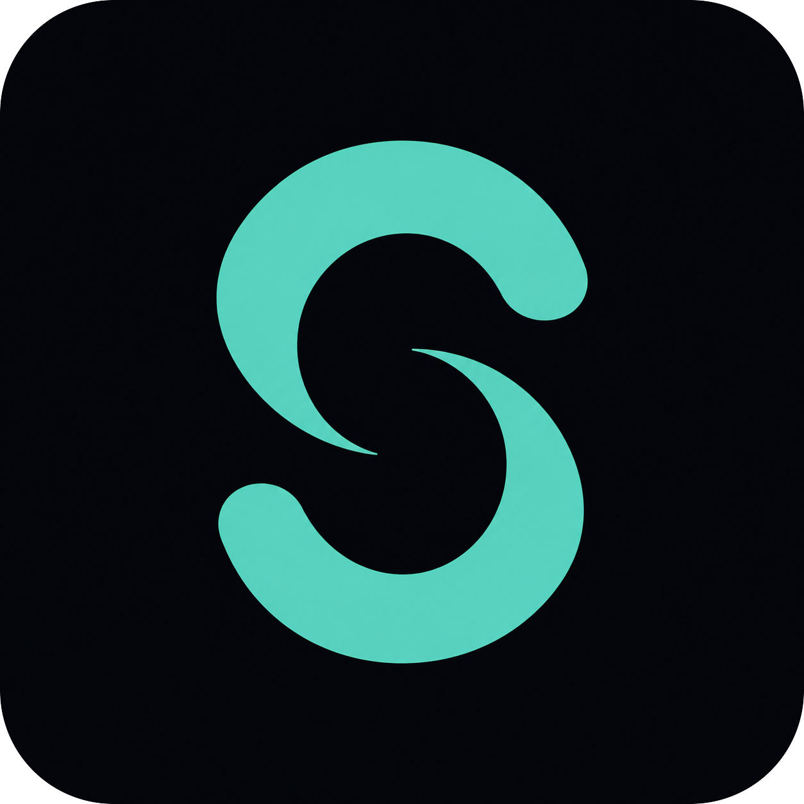

<!--
  POLISHED HEADER MOCKUP for Sonara (non-destructive: your real README.md is untouched).
  Every image below is generated live from a URL. Nothing is stored in the repo except this text.
  Legend of the building blocks used:
    - capsule-render  -> the waving banner image (kyechan99/capsule-render)
    - shields.io      -> each colored badge pill (badges/shields)
    - simple-icons    -> the little logo ON a badge, via shields' ?logo= parameter
    - skill-icons     -> the tech-stack icon row (tandpfun/skill-icons, served at skillicons.dev)
-->

<!-- ===== optional animated banner (capsule-render) ===== -->

  

<!-- ===== branded logo + title + tagline (your existing logo) ===== -->

  

  # Sonara

  **Eyes-free text-to-speech for [Claude Code](https://claude.ai/code) on Windows, an accessibility tool for blind and low-vision developers.**

  <!-- ===== badges (shields.io; the ?logo= pulls a simple-icons logo onto the pill) ===== -->
  
  
  
  
  
  

   

  <!-- ===== tech stack (skill-icons) ===== -->
  

---

> The rest of your README (Requirements, Install, Controls, etc.) continues unchanged below.
> This mockup only replaces the top block. Dynamic alternatives you could swap in once the
> repo is public:
>
> - live license:  `https://img.shields.io/github/license/Maxaubert/sonara`
> - live stars:     `https://img.shields.io/github/stars/Maxaubert/sonara?style=social`
> - latest release: `https://img.shields.io/github/v/release/Maxaubert/sonara`
