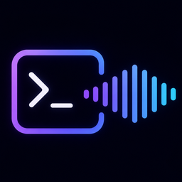

<div align="center">
  

  # Sonara

  **Eyes-free text-to-speech for [Claude Code](https://claude.ai/code) on Windows, an accessibility tool for blind and low-vision developers.**

</div>

---

> The Windows line of Sonara, forked from [nimkimi/sonari](https://github.com/nimkimi/sonari) (the macOS line). Developed and released independently.

Sonara reads Claude Code's output aloud - prose, plans, multiple-choice questions, and
permission prompts - in order, plays a distinct sound the instant a decision needs you, and
lets you answer and control the speech without looking. Run a full session with the screen
off.

- **Ordered narration** - prose, plans, questions, and permissions are spoken in order, never out of sequence.
- **Per-decision earcons** - a distinct sound the moment a question, plan, permission, or error appears.
- **Selection by number** - answer prompts with the option's number; no key injection.
- **Global hotkeys** - navigate the current turn, mute, and cycle between sessions, hands-free (stop, repeat, skip, rate, and more are CLI commands).
- **Lightweight** - the daemon runs on Python's standard library; the one-time `sonara install` fetches the Windows speech engine (PyWinRT) for you, and neural voices stay optional.

## Requirements

- Windows 10 or 11 (Sonara uses the built-in Windows speech engine and `winsound`
  for earcons).
- Python 3.9 or newer on your PATH - install it from
  [python.org](https://www.python.org/downloads/windows/) (the Microsoft Store stub is
  not used). Sonara picks the best `python` >= 3.9 automatically.
- Claude Code 2.1.162 or newer.

Python is the only thing you need beforehand: `sonara install` (below) fetches the Windows
speech engine (PyWinRT) for you with one `pip` step.

## Install

Sonara installs from a Claude Code marketplace, then one required setup command wires up
the speech engine, autostart, hooks, and hotkeys.

1. Add the marketplace: `/plugin marketplace add Maxaubert/sonara` (or, in a shell,
   `claude plugin marketplace add Maxaubert/sonara`).
2. Install the plugin: `/plugin install sonara@sonara` (or
   `claude plugin install sonara@sonara`). The marketplace is named `sonara`, so the
   install target is `sonara@sonara`.
3. **Run `/sonara:install`** - the required one-time setup. It installs the Windows speech
   engine (PyWinRT) into your Python, copies the runtime to `~/.sonara/app`, and registers
   autostart, the Claude Code hooks, and global hotkeys. Each step is printed; it can take
   a minute (it downloads the speech-engine packages).
4. Start a new Claude Code session and run `/sonara:doctor` to confirm everything is green.
   You'll hear Claude read its output from then on.

For local development you can skip the marketplace and load the repo per session with
`claude --plugin-dir <path-to-sonara>`.

If you already have `sonara` on your PATH, the CLI equivalent of step 3 is:

```bash
sonara install
```

`sonara install` resolves the best `python` >= 3.9, **installs the speech engine
(PyWinRT)**, **copies the runtime to `~/.sonara/app`** (so it survives plugin
auto-updates), registers the Windows autostart entry, and places the `sonara` launcher on
your PATH. If it can't install PyWinRT (for example, no network), it prints the exact
`pip` command to run and exits non-zero, so it never silently leaves you without speech.
After a plugin update, Sonara says once - *"Sonara was updated. Run /sonara:install
to apply."* - so you can refresh the copy.

### Development

Contributors can run the test suite from a venv:

```powershell
python -m venv .venv; .venv\Scripts\pip install -e '.[dev]'
.venv\Scripts\python -m pytest -q
```

The public install path above does **not** use `pip` - the venv is for tests only.

## Enhanced-voice setup (recommended)

Sonara defaults to the best natural/neural English voice it can find. Windows natural voices
sound much better and are free and offline. To install one:

1. Open **Settings → Time & language → Speech**.
2. Under **Manage voices**, click **Add voices**.
3. Pick an English voice marked **(Natural)** - e.g. *Microsoft Ava (Natural)* or
   *Microsoft Andrew (Natural)* - and download it.
4. Run `sonara doctor` to confirm Sonara picks it up, or set it explicitly:

```powershell
sonara voice "Microsoft Ava (Natural)"
```

## Chatterbox voices (optional, GPU)

Sonara can use **Resemble AI Chatterbox** (MIT) as a third voice engine alongside Windows
native and Kokoro. Chatterbox runs on your GPU via a persistent worker subprocess; voices are
your own 10-second reference WAV clips, which the model imitates for unlimited voice
variety. Requires an NVIDIA GPU.

**One-time setup:**

```powershell
sonara voices install chatterbox
```

This downloads the Chatterbox Turbo model (~2 GB) and cached weights to `~/.sonara/chatterbox/`.
Network is required; the setup includes a smoke-test synthesis to measure your GPU latency and
VRAM footprint. After installation, voice models stay on disk; synthesis is fully local.

**Adding voices:**

Drop 10-second clean speech WAV clips into `~/.sonara/voices/chatterbox/`. The filename
(without `.wav`) becomes the voice name. For example, `alice.wav` creates the voice `alice`.
Run `sonara voice` to list all available voices across all engines, or `sonara voice alice`
to select.

Voices are your registered clips; without any, Chatterbox uses the model's
standard voice.

**Fallback:**

A chosen Chatterbox voice always tries Chatterbox. When the model is loaded, it idles for 10
minutes before unloading to free VRAM back to your system (configurable via
`chatterbox_idle_unload_s`).

A genuine failure (missing weights, worker error, or timeout) falls back to Kokoro, and
the first such failure in a daemon run speaks a short notice ("Chatterbox unavailable, using
Heart") so you know why the voice changed; later failures stay quiet. Every fallback logs its
reason to `~/.sonara/speechd.log`. The fallback voice is Kokoro's af_heart, so keep the Kokoro
voices installed alongside Chatterbox.
Speech is synthesized and played in chunks, so hotkeys (mute, navigate, pause, skip) take
effect within a chunk (roughly 2 seconds) rather than waiting for the whole utterance. The
`chatterbox_timeout` setting (default 120 seconds; it must cover the ~40s post-idle cold model reload) bounds each chunk, not the entire utterance.
Also expect a one-time pause of roughly 10 to 40 seconds before the first Chatterbox
utterance after a daemon start or an idle unload; that is the model loading onto the GPU.
Later utterances start immediately.

**Limitation:**

The `sonara rate <wpm>` speech-rate setting does not affect Chatterbox voices (the model has
no rate control). Kokoro rate changes apply normally.

**To remove:**

```powershell
sonara voices uninstall chatterbox
```

## Controls and slash commands

Control is via global hotkeys (work even mid-speech), the `sonara` CLI, and namespaced slash
commands inside a session.

### Global hotkeys

Default modifier is **Ctrl+Alt** (rebindable via `~/.sonara/keymap.json`). The daemon
registers these as Windows global hotkeys, so no extra accessibility permission is needed.

Only these actions are bound by default (kept minimal so Sonara doesn't hog
hotkeys). `pause`, `faster`, and `slower` are valid actions but ship **unbound** –
add a key in `~/.sonara/keymap.json` if you want one. Everything else (stop,
repeat, skip, jump-to-decision, catch-up, re-read) lives in the CLI / slash
commands below.

| Hotkey | Effect |
|---|---|
| Ctrl+Alt+Left | Previous item – step back through the current turn |
| Ctrl+Alt+Right | Next item – step forward through the current turn |
| Ctrl+Alt+Up | Jump to the start of the current turn and replay from the top |
| Ctrl+Alt+Down | Flush – skip the rest of this session's queue and go quiet (recoverable via catch-up) |
| Ctrl+Alt+M | Cycle mute: Unmuted → Muted (speech) → Super muted (speech + beeps) |
| Ctrl+Alt+P | Cycle to the next session in a fixed round-robin (resumes an unread session, replays a read one). Says "Session changed: &lt;folder&gt;." |

### Selecting options

When a question, permission prompt, or plan (`AskUserQuestion` / permission /
`ExitPlanMode`) appears, choose an option by pressing its **number (1-9)**, or `Esc` to
cancel - using Claude Code's native numeric selection, no key injection. For a
**multi-select** question, press each option's number (or `Space` on the highlighted item),
then `Enter` to confirm. If a question has **more than nine options**, numbers cover 1-9;
use the **arrow keys** plus `Enter` for the tenth and beyond. Sonara speaks these cues when
they apply.

### Slash commands and CLI

Most of these ship as `/sonara:` slash commands (the files in `commands/`); the rest are
CLI-only (run `sonara <cmd>` in a terminal).

| Slash command | CLI | Effect |
|---|---|---|
| `/sonara:install` | `sonara install` | One-time setup: speech engine (PyWinRT), autostart, global hotkeys, control CLI (copies runtime to `~/.sonara/app`) |
| `/sonara:uninstall` | `sonara uninstall` | Remove the autostart entry, launcher, and `~/.sonara/app` (keeps your settings) |
| `/sonara:status` | `sonara status` | Show voice, rate, verbosity, min-queue, foreground session, queue length |
| `/sonara:verbosity <level>` | `sonara verbosity <level>` | Set `everything` / `medium` / `quiet` |
| `/sonara:voice <name>` | `sonara voice <name>` | Set the speech voice (omit the name to list voices) |
| `/sonara:voices` | `sonara voices` | Install or remove neural voices (Kokoro or Chatterbox) |
| `/sonara:rate <wpm>` | `sonara rate <wpm>` | Set words-per-minute |
| `/sonara:minqueue <n>` | `sonara minqueue <n>` | Batch this many items before reading (1-10; 1 = read immediately) |
| `/sonara:summary [on\|off]` | `sonara summary [on\|off]` | Speak an AI recap of each finished turn instead of full narration (off = full narration; bare prints state) |
| - | `sonara repeat` | Re-speak the last item |
| - | `sonara skip` | Skip the current item |
| - | `sonara stop` | Stop now and clear the queue |
| - | `sonara shutdown` | Stop the daemon and supervisor; stays stopped until `sonara start` |
| - | `sonara start` | Start the daemon (clears a previous shutdown) |
| `/sonara:settings` | `sonara settings` | Open the browser settings page (voice, rate, summary, audio duck, hotkeys, daemon) |
| `/sonara:doctor` | `sonara doctor` | Run all health checks |
| `/sonara:keymap` | `sonara keymap` | Show the active global hotkey bindings |

## Verbosity

Three live-switchable levels (earcons fire in **all** of them):

- **everything** (default) - prose narration, questions, plans, permissions, *and* brief
  tool announcements (a short summary of what's running, e.g. "Running git status").
- **medium** - prose narration plus decisions (questions / plans / permissions); **drops**
  routine tool announcements.
- **quiet** - decisions only (questions / plans / permissions); drops both tool
  announcements **and** prose narration. Earcons still fire at every level.

## Summary mode

`sonara summary on` switches Sonara to a recap style: instead of narrating a whole
response, Sonara waits for the message to finish and reads a 1-2 sentence summary.
Decisions (questions, plans, permission prompts) are still read in full, every
earcon still fires, and the full text stays in history, so `sonara repeat` and
catch-up can still read everything.

How it works: when a turn finishes, Sonara runs a separate, throwaway
`claude -p` call (default model: Haiku, tool-disabled) with only that message's
text and speaks the result. Your main Claude session is untouched, and nothing is
added to its context. The recap call reuses your existing Claude Code login and its
tokens count against your plan (one small call per finished message); expect a few
seconds between the message finishing and the recap being spoken. If the call
fails (offline, timeout), Sonara plays a brief cue and stays quiet, the full text
remains available via catch-up. Summary mode is off by default.

## How ordering works

Sonara's voice never jumps ahead of you. Spoken content is **strictly first-in, first-out**: a
question, plan, or permission is voiced *in its natural place* - after the prose that
explains it - so if the voice is mid-sentence when a permission appears, you still hear the
remaining sentences first, then the permission. What *is* instant is the **alert**: the
moment any decision appears, a short distinct earcon plays immediately (a different sound for
permission, choice, plan, error, turn-done, and ready), while the spoken detail waits its
turn in the queue. Claude Code blocks on the prompt until you respond, so hearing the
context first costs nothing. "Higher priority" therefore means *"alert you instantly with a
sound,"* never *"speak it out of order."*

## Per-session behavior

Sonara tracks a single **foreground** session (set by `SessionStart` and each
`UserPromptSubmit`). Only the foreground session is *spoken*; if you run multiple sessions,
background sessions still fire decision **earcons** so you are alerted, but their prose and
decision text are not read aloud until you bring that session forward. Submitting a new
prompt or stopping flushes the queue, so the voice always resumes at what is current.

To manually cycle the voice to another session without switching windows, press
**Ctrl+Alt+P**. Sonara advances to the next session in a
fixed round-robin order, plays a short chime, and says "Session changed: &lt;folder&gt;." An
unread session resumes from where it left off; a fully-read session is replayed from the
top.

## Doctor and troubleshooting

Run `sonara doctor` first - it reports each check as pass/fail. Common issues:

- **No speech at all.** Confirm `sonara status` shows your session as the foreground. The
  daemon starts lazily on the first hook; if the socket is unreachable, run `sonara install`
  to (re)load the daemon (`sonara doctor` tells you whether the socket is reachable), or
  check `~/.sonara/speechd.log`.
- **Robotic voice.** No enhanced voice is installed; see *Enhanced-voice setup* above.
- **Hooks not firing.** Re-enable `sonara` via `/plugin` (or re-launch with
  `claude --plugin-dir /path/to/sonara`), then run `sonara doctor` and confirm the
  `plugin hooks.json` check passes.
- **Speech too fast/slow.** `sonara rate 180` (default is 200 wpm).
- **Too chatty.** `sonara verbosity medium` or `sonara verbosity quiet`.
- **Everything is stuck.** `sonara stop` clears the queue and cancels the current utterance.

State, config, the socket, and logs all live under `~/.sonara/`
(`config.json`, `speechd.sock`, `speechd.log`).

## Uninstall

To remove Sonara, disable the `sonara` plugin via `/plugin` (or stop passing
`--plugin-dir`), then run:

```powershell
sonara uninstall
```

`sonara uninstall` removes the Windows autostart entry and the `sonara` launcher.
It preserves your `~/.sonara/config.json` and
`~/.sonara/keymap.json` so your settings survive a reinstall.

The in-session equivalent is `/sonara:uninstall`. Uninstall also removes the
stable app copy at `~/.sonara/app`, and **preserves** your `config.json` and
`keymap.json`.

## Privacy

Sonara runs entirely on your own computer. It collects nothing, sends nothing over the network
(except, if you opt in, summary mode's local `claude -p` call described above),
and has no servers, telemetry, or analytics - the text it speaks is processed locally and is
never stored or transmitted. See [PRIVACY.md](PRIVACY.md) for the full details.

## License

MIT - see [LICENSE](LICENSE).
